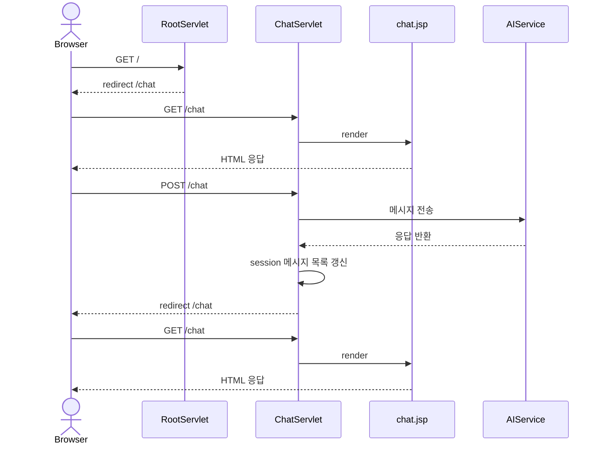
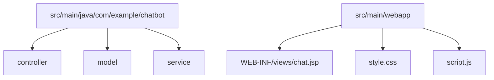

# JSP 챗봇

Jakarta EE 기반의 웹 챗봇 애플리케이션입니다. Servlet, JSP/JSTL/EL로 화면을 구성하고, Google GenAI SDK로 응답을 생성합니다.

## 동작 흐름



## 구조



## 실행 방법

1. 빌드

```bash
./mvnw clean package
```

2. 생성된 WAR를 Tomcat 10+에 배포합니다.

## 환경변수

- `GEMINI_API_KEY`: Google GenAI 호출에 필요한 API 키
